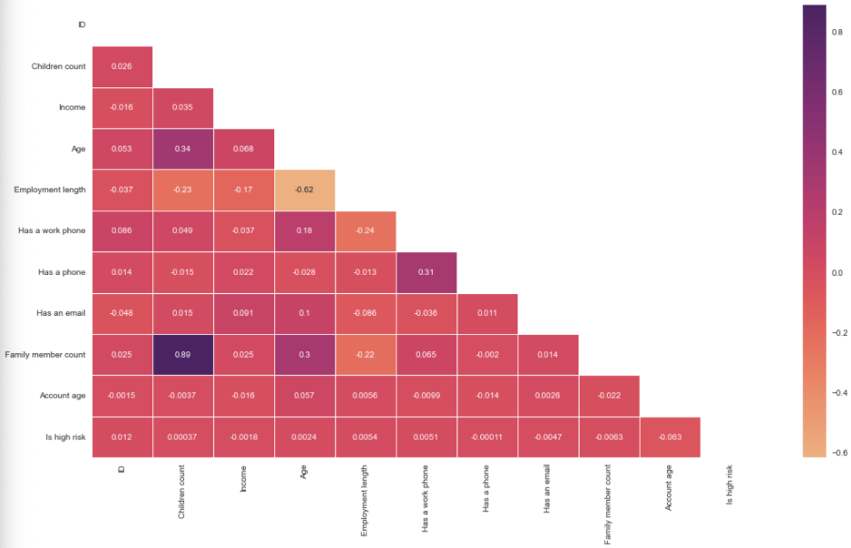
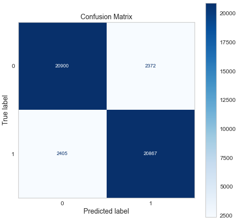
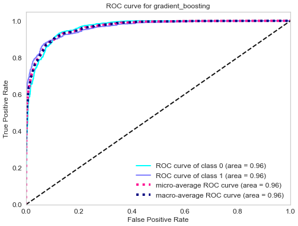
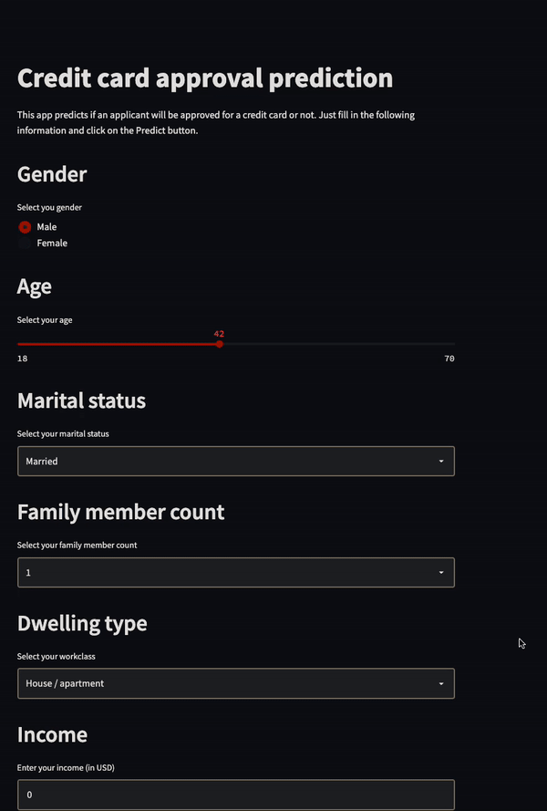

[](https://colab.research.google.com/drive/1CfV6yEsHBjFiJbTKwY72k2g4AvszcF5R)
[](https://share.streamlit.io/semasuka/credit-card-approval-prediction-classification/main/cc_approval_pred.py)
[](https://github.com/ellerbrock/open-source-badges/)

Badge [source](https://shields.io/)

# Key findings: People with the highest income, and who have at least one partner, are more likely to be approved for a credit card.


## Authors

- [@semasuka](https://www.github.com/semasuka)

## Table of Contents

  - [Business problem](#business-problem)
  - [Data source](#data-source)
  - [Methods](#methods)
  - [Tech Stack](#tech-stack)
  - [Quick glance at the results](#quick-glance-at-the-results)
  - [Lessons learned and recommendation](#lessons-learned-and-recommendation)
  - [Limitation and what can be improved](#limitation-and-what-can-be-improved)
  - [Run Locally](#run-locally)
  - [Explore the notebook](#explore-the-notebook)
  - [Deployment on streamlit](#deployment-on-streamlit)
  - [App deployed on Streamlit](#app-deployed-on-streamlit)
  - [Repository structure](#repository-structure)
  - [Contribution](#contribution)
  - [License](#license)


## Business problem

This app predicts if an applicant will be approved for a credit card or not. Each time there is a hard enquiry your credit score is affected negatively. This app predict the probability of being approved without affecting your credit score. This app can be used by applicant who wants to find out if they will be approved for a credit card without affecting their credit score.
## Data source

- [Kaggle credit card approval prediction](https://www.kaggle.com/rikdifos/credit-card-approval-prediction)

## Methods

- Exploratory data analysis
- Bivariate analysis
- Multivariate correlation
- S3 bucket model hosting
- Model deployment
## Tech Stack

- Python (refer to requirement.txt for the packages used in this project)
- Streamlit (interface for the model)
- AWS S3 (model storage)


## Quick glance at the results

Correlation between the features.



Confusion matrix of gradient boosting classifier.



ROC curve of gradient boosting classifier.



Top 3 models (with default parameters)

| Model     	                | Recall score 	|
|-------------------	        |------------------	|
| Support vector machine     	| 88% 	            |
| Gradient boosting    	        | 90% 	            |
| Adaboost               	    | 79% 	            |


- ***The final model used is: Gradient boosting***
- ***Metrics used: Recall***
- Why choose precision as metrics:
  Since the objective of this problem is to minimize the risk of credit default for the financial institution, the metrics to use depends on the current economical situation:

  - During the time of a bull market (when the economy is expending), people feel wealthy and usually are employed. Money is usually cheap and the risk of default is low. The financial institution is able to handle the risk of default therefore is not very strict on giving out credit. The financial institution can handle a number of bad clients as long as the vast majority of applicants are good clients (aka those who payback their credit).In this case, having a good recall (sensitivity) is ideal.
  - During a bear market (when the economy is contracting), people loose their jobs and their money through the stock market. Many people struggle to meet their financial obligations. The financial institution therefore tend to be more conservative on giving out credit or loans. The financial institution can't afford to give out credit to clients who won't be able to pay back their credit. The financial institution would rather have a smaller number of good clients even if it means that some good clients where denied credit, and ideally not have any bad client. In this case, having a good precision (specificity) is desirable.

    Note: There is always a trade-off between precision and recall. Choosing the right metrics depends on the problem you are solving.

    Conclusion: In our case, since we are in the longest bull market (not including the March 2020 flash crash), we will use recall as our metric.


## Lessons learned and recommendation

- Based on the analysis on this project, we found out that income, family member count and employment length, are the most predictive features to determine if an applicant will be approved for a credit card or not. Other features like age and working employment status are also useful. The least useful features are: type of dwelling and car ownership.
- Recommendation would be to focus more on the most predictive feature when looking at the applicant profile, and pay less attention on the least predictive features.
## Limitation and what can be improved

- Combine this model with with a regression model to predict how much of a credit limit an applicant will be approved for.
- Hyperparameter tuning with grid search or random search.
- Better interpretation of the chi-square test
- Retrain the model without the least predictive features
- Hyperparameter tuning: I used RandomSearchCV to save time but could be improved by couple of % with GridSearchCV.


## Run Locally
Initialize git

```bash
git init
```


Clone the project

```bash
git clone https://github.com/semasuka/Credit-card-approval-prediction-classification.git
```

enter the project directory

```bash
cd Credit-card-approval-prediction-classification
```

Create a conda virtual environment and install all the packages from the environment.yml (recommended)

```bash
conda env create --prefix <env_name> --file assets/environment.yml
```

Activate the conda environment

```bash
conda activate <env_name>
```

List all the packages installed

```bash
conda list
```

Start the streamlit server locally

```bash
streamlit run cc_approval_pred.py
```
If you are having issue with streamlit, please follow [this tutorial on how to set up streamlit](https://docs.streamlit.io/library/get-started/installation)

## Explore the notebook

To explore the notebook file [here](https://nbviewer.org/github/semasuka/Credit-card-approval-prediction-classification/blob/main/Credit_card_approval_prediction.ipynb)

## Deployment on streamlit

To deploy this project on streamlit share, follow these steps:

- first, make sure you upload your files on Github, including a requirements.txt file
- go to [streamlit share](https://share.streamlit.io/)
- login with Github, Google, etc.
- click on new app button
- select the Github repo name, branch, python file with the streamlit codes
- click advanced settings, select python version 3.9 and add the secret keys if your model is stored on AWS or GCP bucket
- then save and deploy!

## App deployed on Streamlit



Video to gif [tool](https://ezgif.com/)
## Repository structure


```

├── assets
│   ├── confusion_matrix.png                      <- confusion matrix image used in the README.
│   ├── gif_streamlit.gif                         <- gif file used in the README.
│   ├── heatmap.png                               <- heatmap image used in the README.
│   ├── Credit_card_approval_banner.png           <- banner image used in the README.
│   ├── environment.yml                           <- list of all the dependencies with their versions(for conda environment).
│   ├── roc.png                                   <- ROC image used in the README.
│
├── datasets
│   ├── application_record.csv                    <- the dataset with profile information (without the target variable).
│   ├── credit_records.csv                        <- the dataset with account credit records (used to derive the target variable).
│   ├── test.csv                                  <- the test data (with target variable).
│   ├── train.csv                                 <- the train data (with target variable).
│
│
├── pandas_profile_file
│   ├── credit_pred_profile.html                  <- exported panda profile html file.
│
│
├── .gitignore                                    <- used to ignore certain folder and files that won't be commit to git.
│
│
├── Credit_card_approval_prediction.ipynb         <- main python notebook where all the analysis and modeling are done.
│
│
├── LICENSE                                       <- license file.
│
│
├── cc_approval_pred.py                           <- file with the model and streamlit component for rendering the interface.
│
│
├── README.md                                     <- this readme file.
│
│
├── requirements.txt                              <- list of all the dependencies with their versions(used for Streamlit).

```
## Contribution

Pull requests are welcome! For major changes, please open an issue first to discuss what you would like to change or contribute.

## License

MIT License

Copyright (c) 2022 Stern Semasuka

Permission is hereby granted, free of charge, to any person obtaining a copy
of this software and associated documentation files (the "Software"), to deal
in the Software without restriction, including without limitation the rights
to use, copy, modify, merge, publish, distribute, sublicense, and/or sell
copies of the Software, and to permit persons to whom the Software is
furnished to do so, subject to the following conditions:

The above copyright notice and this permission notice shall be included in all
copies or substantial portions of the Software.

THE SOFTWARE IS PROVIDED "AS IS", WITHOUT WARRANTY OF ANY KIND, EXPRESS OR
IMPLIED, INCLUDING BUT NOT LIMITED TO THE WARRANTIES OF MERCHANTABILITY,
FITNESS FOR A PARTICULAR PURPOSE AND NONINFRINGEMENT. IN NO EVENT SHALL THE
AUTHORS OR COPYRIGHT HOLDERS BE LIABLE FOR ANY CLAIM, DAMAGES OR OTHER
LIABILITY, WHETHER IN AN ACTION OF CONTRACT, TORT OR OTHERWISE, ARISING FROM,
OUT OF OR IN CONNECTION WITH THE SOFTWARE OR THE USE OR OTHER DEALINGS IN THE
SOFTWARE.

Learn more about [MIT](https://choosealicense.com/licenses/mit/) license
